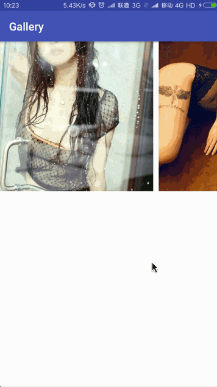

# Gallery

#### 通过RecyclerView实现的Gallery效果

主要特点是左右两边可以看到前后的边界。
效果如下：

 

使用步骤：

1. 加入依赖 
```
compile 'com.wan7451:gallery:1.0.1'
```
2. 在布局中加入组件
```
<com.wan7451.gallery.Gallery
     android:id="@+id/gallery"
     android:layout_width="match_parent"
     android:layout_height="270dp" />
```
3. 组件的简单配置
```
Gallery viewPager = (Gallery) findViewById(R.id.gallery);
viewPager.setClipWidth(dip2px(this, 20));  //左右两边边界的宽度  
viewPager.setInterval(dip2px(this, 10));   //itemView 之间的间隔距离
 ```
 
4. 创建适配器
```
class QSAdapter extends GalleryAdapter<String> {
       
    public QSAdapter(Context context, ArrayList<String> list) {
        super(context, list);
    }
       
    @Override
    protected int getConvertLayout() {
        return R.layout.item_viewpager;
    }
    
    @Override
    public void onBindViewHolder(ViewHolder holder, int position) {
        ImageView img = holder.getView(R.id.image);
        Glide.with(getContext()).load(getList().get(position))
            .centerCrop()
            .into(img);
    }
}
``` 
5. 设置适配器
```
viewPager.setAdapter(new QSAdapter(this, data));
```